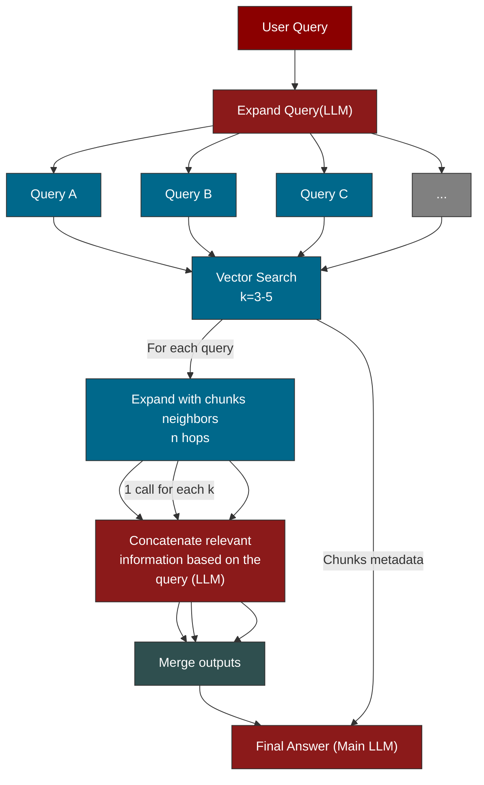

## Graph-Augmented Retrieval for Efficient Factual Question Answering

This projects explores a graph-first Retrieval-Augmented Generation (RAG) system for answering questions about scientific papers. Unlike traditional RAG pipelines that rely on large unstructured context windows, this system combines vector similarity search with knowledge graph traversal to retrieve, ground, and compress relevant information before answer generation. Papers are ingested from PDFs, chunked, embedded, and connected through explicit semantic relationships in a Neo4j graph. Multi-stage LLM summarization ensures token-efficient reasoning while preserving provenance and factual grounding. The system is optimized for content understanding rather than bibliographic queries and demonstrates a practical alternative to chain-based RAG frameworks for research-oriented applications.

## Features

- **Graph-Augmented Retrieval**: Combines vector search with knowledge graph traversal to find relevant context.
- **PDF Ingestion**: Automatically extracts text and metadata from uploaded PDF papers.
- **Neo4j Integration**: Stores papers, chunks, and relationships in a Neo4j graph database.
- **LLM Powered**: Uses OpenAI and Groq for query expansion, summarization, and response generation.
- **Interactive UI**: Gradio-based web interface for easy interaction.

## Prerequisites

- Python 3.10+
- [Neo4j Desktop](https://neo4j.com/download/)
- API Keys for:
    - OpenAI
    - Groq

## Installation

1.  **Clone the repository:**
    ```bash
    git clone <repository_url>
    cd knowledge_graphs
    ```

2.  **Install dependencies:**
    ```bash
    pip install -r requirements.txt
    ```

## Configuration

1.  **Environment Variables:**
    Create a `.env` file in the root directory and add your API keys and database credentials:

    ```env
    NEO4J_PASSWORD=your_neo4j_password
    OPENAI_API_KEY=your_openai_api_key
    FREE_GROQ_API_KEY=your_groq_api_key
    ```

2.  **Config File:**
    You can customize the application settings in `config.yaml`. This includes:
    - Neo4j URI and username.
    - Embedding model settings.
    - Chunking parameters.
    - LLM provider and model selection for different agents (query expansion, summarization, response generation).

## Usage

1.  **Start Neo4j:**
    Ensure your Neo4j database is running and accessible at the URI specified in `config.yaml` (default: `neo4j://localhost:7687`).

2.  **Run the Application:**
    ```bash
    python app.py
    ```

3.  **Access the UI:**
    Open your web browser and navigate to `http://localhost:7860`.

4.  **Ingest Papers:**
    - Use the "Upload a paper as PDF" section to upload a research paper.
    - The system will process the PDF, extract text and metadata, and populate the knowledge graph.

5.  **Ask Questions:**
    - Enter your query in the text box.
    - Click "Run Explanation" to get an answer based on the knowledge graph.

## Project Structure

- `app.py`: Main entry point for the Gradio application.
- `knowledge_graph.py`: Handles graph construction and Neo4j interactions.
- `rag.py`: Implements the RAG pipeline (retrieval, expansion, generation).
- `config.py` & `config.yaml`: Configuration management.
- `llm/`: Contains clients for Groq and OpenAI.
- `data/`: Directory for storing data (if applicable).

#### Design Philosophy
The system is designed to answer factual and complex questions about papers content, not to extract curious or bibliographic facts.
Thus:
- Metadata is minimal and conservative
- Paper structure is initially treated as flat text
- Graph structure is used for reasoning and provenance, not citation formatting

#### System Architecture
High-level flow


#### Metadata Model
Each paper is stored as a lightweight metadata structure:
```json
{
  "paper": "BERT: Pre-training of Deep Bidirectional Transformers for Language Understanding",
  "year": 2018,
  "url": "https://arxiv.org/pdf/1810.04805",
  "pdf_path": "data/bert_paper.pdf",
  "tasks": [],
  "datasets": [],
  "model": "",
  "derived_from": ""
}
```
**Extraction strategy**
Extracted via heuristics (current implementation)
- paper (title)
- year
- url
- pdf_path
Reserved for future NLP extraction
- tasks
- datasets
- model
- derived_from

This separation avoids passing full PDFs through LLM context windows and preserves efficiency.

### Knowledge Graph Schema
***Node types***
- Paper
- Chunk
- Task
- Dataset
- Model

***Relationships***
Nodes & their properties
```cypher
(:Paper {paperId, title, year, url})
(:Chunk {chunkId, text, embedding})
(:Task {name})
(:Dataset {name})
(:Model {name})

(:Chunk)-[:BELONGS_TO]->(:Paper)
(:Paper)-[:EXPLAINS_MODEL]->(:Model)
(:Paper)-[:ADDRESSES_TASK]->(:Task)
(:Paper)-[:USES_DATASET]->(:Dataset)
(:Chunk)-[:SIMILAR {score}]->(:Chunk) # Just top k neighbors
(:Model {name:""})-[:DERIVED_FROM]->(:Model {derived_from})
```

#### Retrieval Strategy
multi-stage retrieval pipeline:
1. Query expansion
2. Vector similarity search over chunk embeddings
3. Graph traversal to expand context
4. LLM summarization to compress retrieved content
5. Final answer generation using concatenated context

**Steps 2, 3, 4 happen for each expanded query**

This approach ensures:
- High recall
- Controlled token usage 
- Clear provenance of information

#### UI
Minimalist Gradio UI for demo purposes, supports:
- Uploading PDFs
- Explicit graph population
- Asking questions about ingested papers
**Important distinction:**
Uploading a PDF automatically ingest it into the graph.
Explicit graph population allows to populate the graph with papers that are not ingested yet.

#### Token Efficiency
Unlike naive RAG pipelines that pass large volume of raw text directly to the LLM context window, this system compresses information before final answer generation.
**Where tokens are spent:**
| Stage               | Token Usage | Strategy                                |
| ------------------- | ---------- | --------------------------------------- |
| Query Expansion     | Low        | Short prompts, list-based output        |
| Vector Retrieval    | None       | Pure database operation                 |
| Graph Expansion     | None       | Neo4j traversal only                    |
| Chunk Summarization | Medium     | Parallel, per-chunk compression         |
| Final Answer        | Low–Medium | Uses summaries + metadata, not raw text |

**Key Saving Mechanisms**
1. Early compression of context
2. Graph-bounded context expansion
3. Metadata injection at last stage

#### Failure Cases & Limitations
1. **Poor performance on curiosity-driven questions**
 Optimized for content reasoning, not document layout recovery. Not intended for citation formatting or bibliographic analysis
2. **Loss of structural semantics from PDFs** 
 PDF structure (sections, figures, equations, etc.) is not preserved. Requeest precise structual information may return approximate answers.
3. **Metadata beyond basic heuristics is not guaranteed**
 Graph-level reasoning improves over time but is initially incomplete. The system prefers missing metadata over hallucinated metadata

#### Future Work
- Structured PDF parsing (lazy section graphs)
- NLP-based metadata extraction
- Evaluation benchmarks vs frameworks like GraphRAG
- Filters and validation for PDF uploads, data ingestion and question complexity (to enhance token efficiency)
